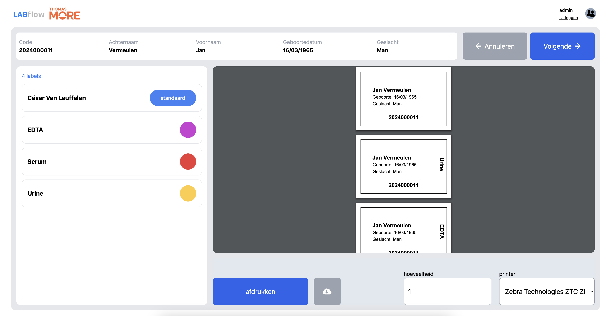
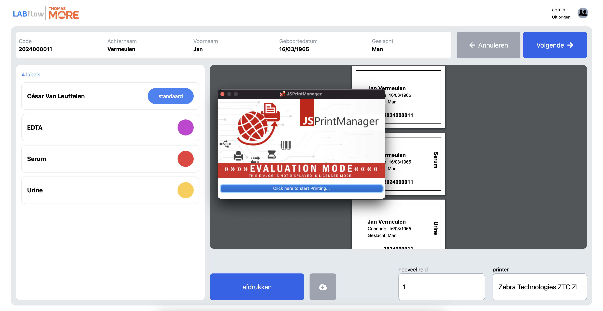

# Installatiehandleiding LABflow

In dit document geven we uitleg over hoe je de LABflow-webapplicatie kunt recreëren en zelf kunt installeren.

**Inhoudstafel:**

- **1** - Hoe een project aanmaken
- **2** - Project klaar voor development
  - **2.1** - Database
  - **2.2** - Backend
  - **2.3** - Frontend
- **3** - Project deployen naar productie
  - **3.1** - Database
  - **3.2** - Backend
  - **3.3** - Frontend
- **4** - PC-installaties
  - **4.1** - Disclaimer
- **5** - Databeheer

## 1 - Hoe een project aanmaken

Eerst en vooral gaan we bespreken hoe je de LABflow-applicatie zelf vanaf nul kunt opstarten. Hieronder wordt stap voor stap uitgelegd hoe je tot hetzelfde startpunt kunt komen als wij.

**Surf naar de volgende website: [Spring Boot Initializer](https://start.spring.io/)**

> Op deze site kun je een Java Spring Boot-project starten zonder zelf te moeten configureren. Deze site genereert voor jou een `pom.xml`-bestand met alle benodigde informatie voor een Spring Boot-project, en je kunt zelf selecteren welke versies je wilt gebruiken van Java, Maven, etc.

**Instellingen:**

- Project: Maven
- Taal: Java
- Spring Boot-versie: 3.3.4
- Group: com.thomasmore.blc
- Artifact: LabFlow
- Naam: LabFlow
- Packaging: JAR
- Java-versie: 17

Je krijgt een ZIP-bestand, dat je moet uitpakken en openen in IntelliJ.

Surf naar [mvnrepository.com](https://mvnrepository.com/) en voeg de volgende dependencies toe:

- [ ] [SQLite JDBC](https://mvnrepository.com/artifact/org.xerial/sqlite-jdbc)
- [ ] [Spring Boot Starter Web](https://mvnrepository.com/artifact/org.springframework.boot/spring-boot-starter-web)
- [ ] [Hibernate ORM Hibernate Community Dialects](https://mvnrepository.com/artifact/org.hibernate.orm/hibernate-community-dialects)
- [ ] [Spring Boot DevTools](https://mvnrepository.com/artifact/org.springframework.boot/spring-boot-devtools)
- [ ] [Spring Boot Starter Test](https://mvnrepository.com/artifact/org.springframework.boot/spring-boot-starter-test)

## 2 - Klaar voor development

### 2.1 - Backend

> Bij het openen van het project krijg je normaal twee grote fouten:

- `.env` ontbreekt
- Alle bestanden met een `.db`-extensie ontbreken

Ga naar `application.properties`

> Pad: `src/main/resources/application.properties`

Plaats de volgende code in dit bestand:

```properties
# .env import
spring.config.import=file:.env[.properties]

spring.application.name=labflow

# Databaseverbinding
spring.datasource.url=jdbc:sqlite:databases/labflow.db
spring.jpa.database-platform=org.hibernate.community.dialect.SQLiteDialect
spring.jpa.hibernate.ddl-auto=create-drop
spring.datasource.driver-class-name=org.sqlite.JDBC

spring.datasource.username=${env.DATABASE_USERNAME}
spring.datasource.password=${env.DATABASE_PASSWORD}

spring.jpa.show-sql=true
```

**Maak een nieuw `.env`-bestand aan:**

1. Maak een duplicaat van het bestand `.env.example`
2. Voeg de volgende regels toe:

```env
DATABASE_USERNAME=admin123
DATABASE_PASSWORD=admin123
```

**Maak de database-map en het bestand aan:**

1. Maak in de root van je applicatie een map `databases` aan.
2. Plaats daarin een bestand `labflow.db`.

> Pad: `databases/labflow.db`

3. Open rechts de tool voor databases.
4. Sleep het `labflow.db`-bestand in het venster van de database-tool.

**Laat het project runnen en kijk of het werkt!**

> Werkt het toch niet? Contacteer [Nathan Neve](mailto:r0742822@student.thomasmore.be) of [César Van Leuffelen](mailto:r0929448@student.thomasmore.be).

### 2.2 - Frontend

Voor de frontend gebruiken we **Svelte**: documentatie -> [docs](https://svelte.dev/docs/introduction).

Installatie:

```bash
npm create svelte@latest labflow-frontend
cd labflow-frontend
npm install
npm run dev
```

Door deze commando's uit te voeren, maken we een startproject aan. Hierna installeren we onze benodigde packages met `npm install`.

Met `npm run dev` starten we een development server op poort 5173, de standaardpoort voor Svelte-applicaties.

- Voor Windows & Mac: [http://localhost:5173/](http://localhost:5173/)
- Voor Linux/Unix-based systemen: [http://0.0.0.0:5173/](http://0.0.0.0:5173/)

Meer informatie is te vinden in `code/labflow-frontend/README.md`.

#### 2.2.1 Hosting

Voor onze frontend-hosting hebben we gekozen voor GitHub Pages.
Documentatie: [Tutorial: hosting Svelte-app op GitHub Pages](https://www.okupter.com/blog/deploy-sveltekit-website-to-github-pages).

## 4 - PC-installaties

Wanneer je labels wilt afdrukken op het onderstaande scherm, kun je een van de Zebra ZD421-labelprinters aansluiten op je laptop via de bijgevoegde USB-kabel. Je zult merken dat wanneer je op de knop 'Afdrukken' drukt, er niets gebeurt. Hiervoor moeten we op de gebruikte pc een klein programma downloaden: **JSPrintManager** van [NEOdynamic](https://www.neodynamic.com/).



We raden aan om enkel de link te gebruiken die in deze documentatie staat, om virussen en gevaarlijke programma's te vermijden.

Download **JSPrintManager** hier: [link](https://www.neodynamic.com/downloads/jspm/). Kies het juiste OS. Voor Windows krijg je een uitvoerbaar bestand, voor Mac een `.pkg`-bestand.

> ⚠️ Je computer kan waarschuwen dat het bestand onveilig is. Als je het bestand via de bovenstaande link hebt gedownload, is het veilig!

Na installatie zou de applicatie automatisch moeten starten. Als je nog steeds niets kunt afdrukken, zoek dan de applicatie en start deze handmatig.

Top! Je bent klaar om labels te printen.

## 4.1 - Disclaimer

Wanneer je probeert af te drukken, zal de software eerst een verontrustend scherm tonen, zoals hieronder afgebeeld. Dit is normaal omdat we de gratis versie van de software gebruiken. Klik gewoon op de afdrukknop en de labels zullen starten met printen als alles correct is geïnstalleerd.

**Prijs licentie:** €150 per maand



## 5 - Databeheer

Onze systemen zijn gemaakt voor schoolomgevingen, daarom slaan wij vooral fictieve gegevens op. Echte gegevens die worden bijgehouden:

- R- of U-nummer van de persoon die de test afneemt
- Accountgegevens (naam, voornaam, e-mail, wachtwoord)
- Naam van de laborant die de test afneemt

Alle andere opgeslagen gegevens zijn fictieve of foutieve namen die worden toegekend aan de stalen. We slaan dus geen echte patiëntgegevens op. Deze gegevens zijn echter wel beveiligd achter een authenticatiesysteem.

Wil je geregistreerde gegevens wijzigen of laten verwijderen? Contacteer ons via:

**E-mail**: [r0929448@student.thomasmore.be](mailto:r0929448@student.thomasmore.be)

**Teams**: César Van Leuffelen

